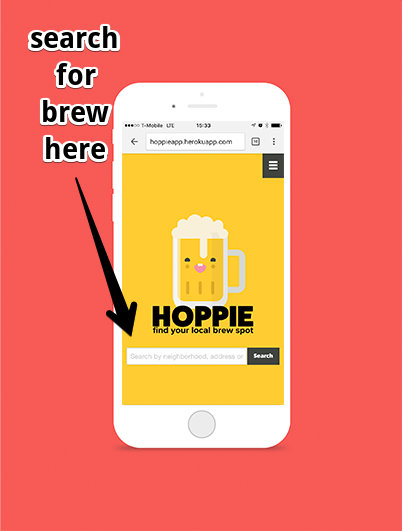
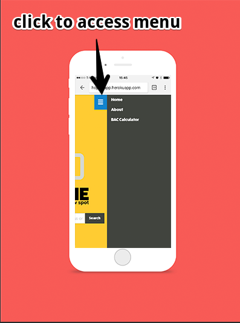

# [Hoppie]("http://hoppieapp.herokuapp.com")

<b>Team Name</b>: Hoppies

<b>Team Members</b>: [Hannah Gaskins]("https://github.com/hnag409"), [Randy Gulling]("https://github.com/rgylling"), [Johnny Luangphasy]("https://github.com/jluangphasy")

The purpose of this project is to create a web app for beer consumers and connoisseurs alike.

A user would want to access the site and be able to find local breweries around them, and find out information
about different types of beers. The app will also include information to calculate BAC and if it is a high number, provide links to UBER and Lyft apps.

## Stories

- as a developer I want to use FP, OOP, middleware, SMACCS, and DRY principles.
- as a developer I want to use the appropriate APIs, and data to display quality information to my users.
-  as a user I want to find information about beer and have interactivity including a BAC with links to driving services so I can get home safely.
- as a user I want to easily navigate the homepage.
- as a user I want to search for local PDX breweries that are close to me. I also want to be able to click and find additional information on the breweries.
- as a user I want to search for different types of beer and access additional information to research that beer.
- as a user I want the additional beer and brewery information to be displayed in a organized fashion to easily see that information.
- as a user I want to know my BAC based on customized inputs I give the site.
- as a user I want to know who created this site and why.
- as a developer I want to use webSQL to persist my site's state.

## Hoppie for dummies

## Domain Model

## Wireframes

